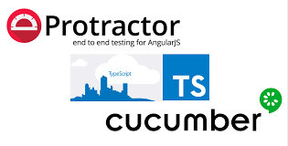
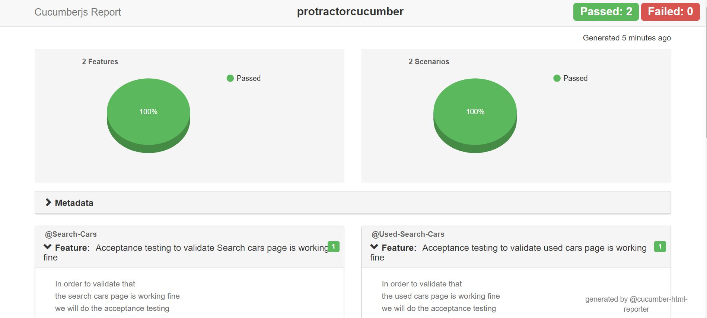
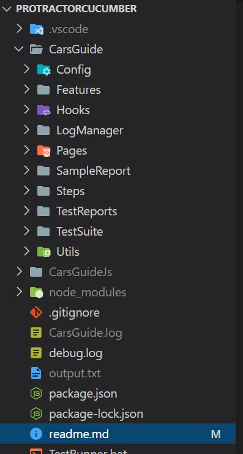
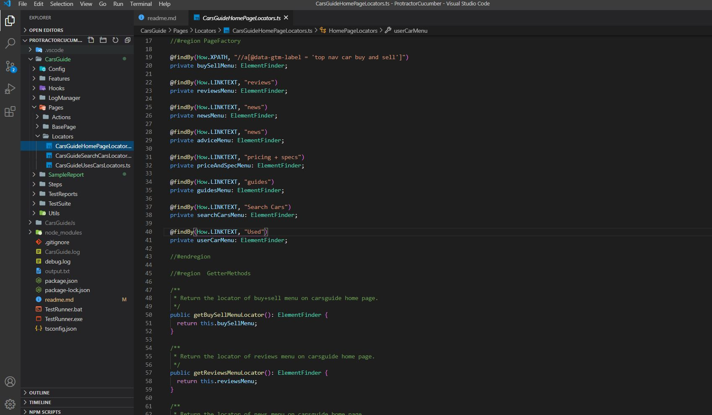
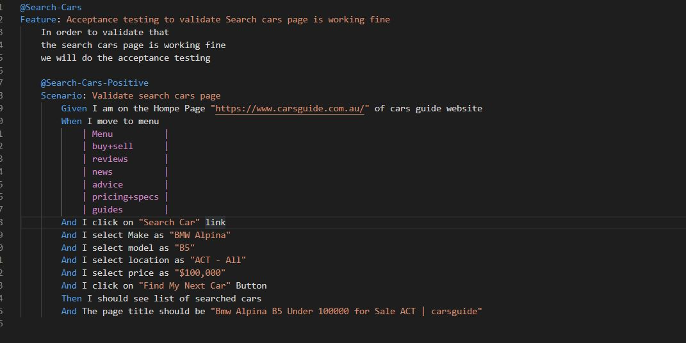
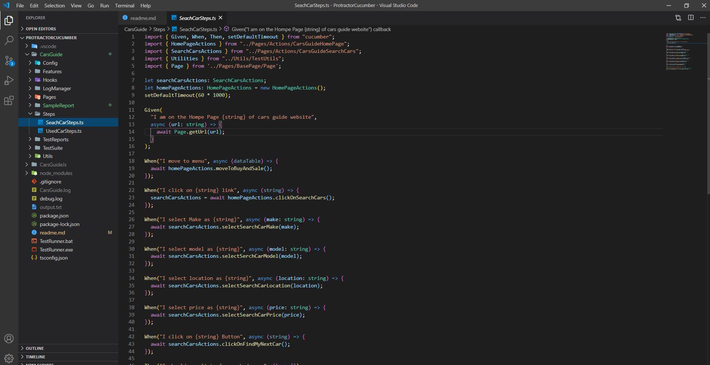

# Pre-requisite to start execution:
1. **Java (JDK)**
2. **Nodejs**
3. **Any IDE such as Visual Studio Code**

# Commands to execute the testcases.
1. **npm install**

    To install all dependencies

2. **npm run webdrivermanager:update**

    To update or install all executable binaries

3. **npm run cucumbertest**

    To Start the Executation

# Reports will gererated in :
1. **TestReports Folder**

    Html Reports

2. **HTML Report will look like**

# The Spec Report during executation will look like that :

# TestExecution can simply started by running:
1. **TestRunner.exe**

    This executable will first install all required dependencies and then start executation.

# Reports will send to mail after executation completed.

# To Send HTML Report on Mail Set Username and Password as ENV Variable.
For More info refer link https://github.com/lkumarra/ProtractorBDDFramework/blob/master/CarsGuide/Config/Config.ts

# Project Structure 

1. **CarsGuide**

        Name of Project

2. **Config**

        Contains configuration file for protractor which has the code for reporting browser and mail.

3. **Features**

        Contains the Feature file

4. **Hooks**

        Contains the Hooks for Screenshot on test failure.

5. **Pages**
    1. **Actions**

            This Folder Contains action class.

    2. **Locators**

            This Folder Contains Locators class.

    3. **BasePage**

            This Folder Contains Base Page Class.

6. **Steps**

        This folder contains the StepDefinitation file.

7. **TestReports**

        All test reports will be generated in this folder.

8. **TestSuite**

        This Folder contains the suite of Steps and Feature.

9. **Utils**

        This Folder contains the Utility and PageFactory class.

# Locators are kept like that:

# Features are kepts like that:

# Steps are Kept like that:
