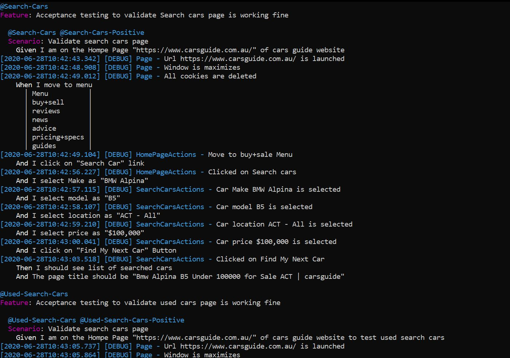

# Prerequisite to start execution:
1. **Java (JDK)**
2. **Nodejs**

# Commands to execute the testcases.
1. **npm install ("To install all dependencies")**
2. **npm run webdrivermanager:update("To update or install all executable binaries")**
3. **npm run cucumbertest("To Start the Executation")**

# Reports will gererated in :
1. **TestReports Folder ("Html Reports")**
2. **HTML Report will look like**

# The Spec Report during run time will look like that :

# TestExecution can simply started by running:
1. **TestRunner.exe("This executable will first install all required dependencies and start executation")**

# Reports will send to mail after executation completed.

# To Send HTML Report on Mail Set Username and Password as ENV Variable.
For More info refer link https://github.com/lkumarra/ProtractorBDDFramework/blob/master/CarsGuide/Config/Config.ts